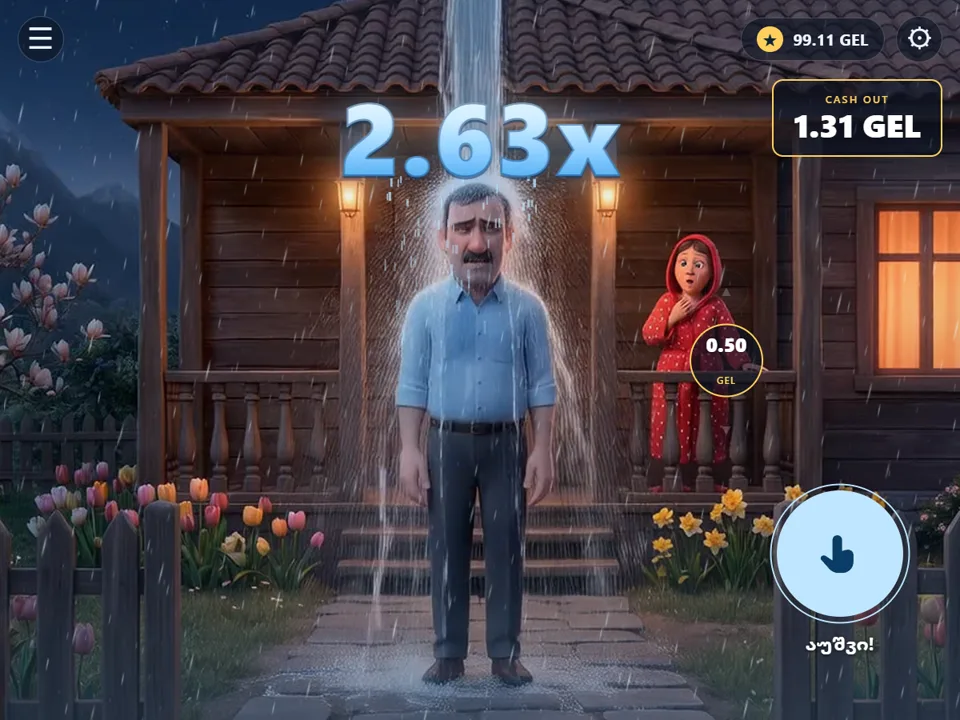
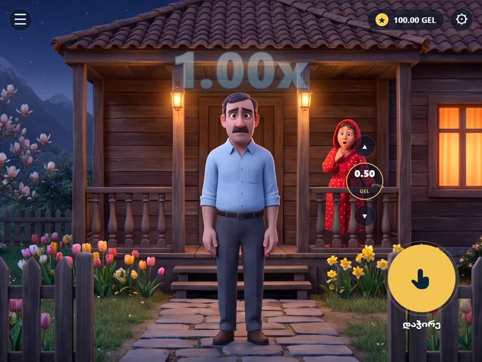
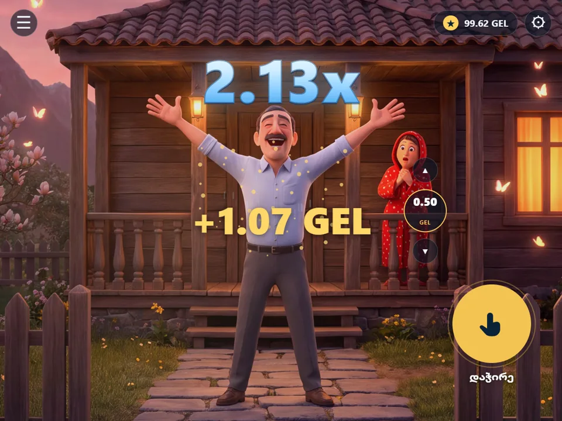
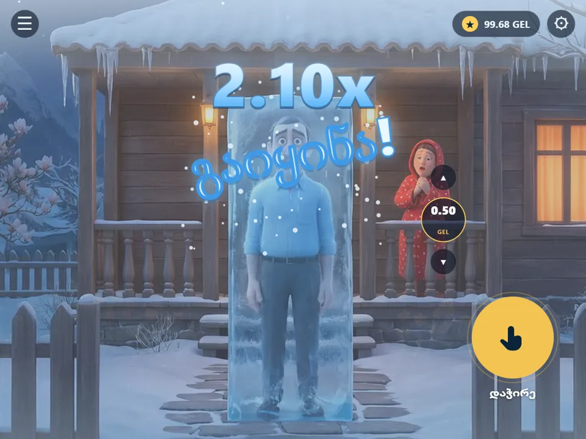
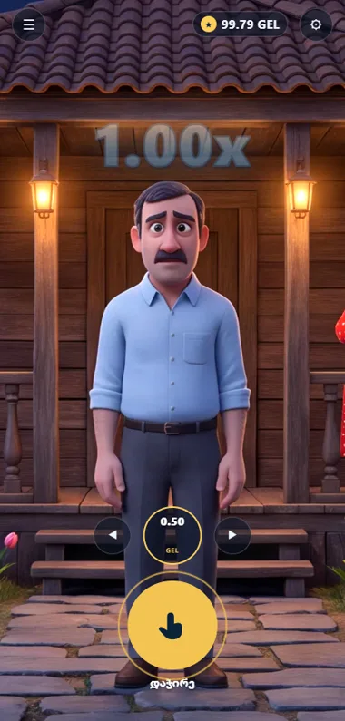

# ჭრიჭინა · Chrichina

**დააჭირე და გეჭიროს — წყალი იღვრება, კოეფიციენტი იზრდება. აუშვი, სანამ გაიყინება.**
*Press and hold to pour, release to cash out — before it freezes.*
*Нажмите и держите — вода льётся, множитель растёт. Отпустите, пока не заморозило.*

[**▶ ითამაშე · Play the demo · Играть**](https://omarokrochelidze-cmd.github.io/Chrichina-Bichiko/)



> **ეს დემოა.** ბალანსი ვირტუალურია — რეალური ფული და გადახდის ინტეგრაცია არ არსებობს.
> **This is a demo.** The balance is virtual — no real money, no payment integration.
> **Это демо.** Баланс виртуальный — реальных денег и платёжной интеграции нет.

---

## 📸

| | |
|:--:|:--:|
|  |  |
| **მოლოდინი** · Idle · Ожидание | **დენა** · Pouring · Льётся |
|  |  |
| **მოგება** · Win · Выигрыш | **გაყინვა** · Frozen · Заморозка |



ტელეფონზე განლაგება გადაეწყობა: ფსონი და Cash Out ღილაკის ზემოთ სვეტად დგება.

---

<details open>
<summary><b>🇬🇪 ქართული</b></summary>

## რა არის ეს

ჭრიჭინა არის *crash*-ტიპის ფსონის თამაშის დემო, „დააჭირე და გეჭიროს" მექანიკით.
ღილაკზე თითის დაჭერისას კაცს თავზე წყალი ეღვრება და კოეფიციენტი ექსპონენციალურად
იზრდება. რაც მეტხანს გეჭირავს, მით მეტი მოგება — მაგრამ ყოველ წამს არსებობს შანსი,
რომ ყველაფერი გაიყინოს და ფსონი დაიკარგოს.

**დამოკიდებულებების და build-ის გარეშე.** არც npm, არც bundler, არც framework —
სამი ფაილი და სურათების საქაღალდე. გასახსნელად უბრალოდ ორმაგად დააწკაპუნე
`chrichina.html`-ზე.

## როგორ ვითამაშო

1. აირჩიე ფსონი ისრებით (▲ ▼ ან ◀ ▶ ტელეფონზე).
2. **დააჭირე და გეჭიროს** მთავარ ღილაკს — კოეფიციენტი იზრდება.
3. **აუშვი** ღილაკი, სანამ გაიყინება — მოგება ბალანსში ჩაგივარდება.
4. თუ დააგვიანე, კაცი ყინულში ექცევა და ფსონი იკარგება.

კლავიატურაზე **Space** იგივეს აკეთებს, რასაც ღილაკზე დაჭერა.
გაყინვის შემდეგ ცალკე „restart" ღილაკი არ არის — უბრალოდ კვლავ დააჭირე.

## გაშვება

```
გახსენი chrichina.html ბრაუზერში (ორმაგი დაწკაპუნება ან ტაბში ჩაგდება)
```

რედაქტირება = შენახვა + განახლება. `scenes/` საქაღალდე HTML-ის გვერდით უნდა იდოს.

## სტრუქტურა

| ფაილი | რას შეიცავს |
|---|---|
| `chrichina.html` | მარკაპი — `#game`-ის ხე და მოდალები |
| `chrichina.css` | დისკრეტული ვიზუალი — მდგომარეობის კლასები, crossfade, წვიმა, portrait |
| `chrichina.js` | ერთი IIFE — მდგომარეობათა მანქანა, ეკონომიკა, ნაწილაკები, ხმა |
| `scenes/` | ოთხი ფონი (`.webp`) და ორი ატმოსფერული ლუპი (`.mp4`) |

გაყოფა **კონცეფციითაა და არა ფაილის ტიპით**: სცენარიანი, დისკრეტული ეფექტები
(ყინვა, ბეჭედი, წვიმის ფენები) CSS-კლასებზეა მიბმული, უწყვეტი და კადრობრივი
ვიზუალი (კოეფიციენტი, ცახცახი, გამჭვირვალობები) კი `render()`-ში იწერება.

## ტექნიკური დეტალები

- **მდგომარეობათა მანქანა:** `idle → pour → recover | frozen`. დაჭერა ახალ რაუნდს
  იწყებს ნებისმიერი მდგომარეობიდან, გარდა `pour`-ისა.
- **მათემატიკა:** `mult = e^(0.5·t)`, crash-განაწილება Aviator-ის სტილისაა
  (~3% მყისიერი, სხვა შემთხვევაში `0.97/(1−r)`, ჭერი ×60 ≈ 8.2 წამი).
- **ნაწილაკები:** ერთი 2D canvas, `devicePixelRatio`-ზე დამასშტაბებული ბუფერით;
  სამი ემიტერი (წვიმა / თოვლი / ნაპერწკლები), ჭერი 1200 ნაწილაკზე.
- **ხმა:** WebAudio, ერთი ოსცილატორის helper-იდან აწყობილი; პირველი ჟესტის შემდეგ
  ეშვება, პარამეტრებში ითიშება.
- **სცენები** ერთი 2×2 ბადის სახით დაგენერირდა და გაიჭრა — ამიტომ სახლი, კაცი,
  ქალი და კამერა ოთხივე კადრში იდენტურია და crossfade არ „ხტება".

## ილუსტრაციები

`scenes/`-ის ფონები და ვიდეო-ლუპები **AI-ით არის დაგენერირებული**.

</details>

<details>
<summary><b>🇬🇧 English</b></summary>

## What this is

Chrichina (ჭრიჭინა) is a demo of a *crash*-style betting game built around a
press-and-hold mechanic. Holding the button pours water over the man and grows a
multiplier exponentially. The longer you hold the more you win — but every moment
carries a chance that everything freezes and the stake is lost.

**No dependencies, no build step.** No npm, no bundler, no framework — three files
and an asset folder. Just double-click `chrichina.html`.

## How to play

1. Pick a stake with the arrows (▲ ▼, or ◀ ▶ on mobile).
2. **Press and hold** the main button — the multiplier climbs.
3. **Release** before it freezes, and the win lands in your balance.
4. Hold too long and the man is encased in ice; the stake is gone.

**Space** does the same thing as pressing the button. There is no separate restart
button after a freeze — just press again.

## Running it

```
Open chrichina.html in a browser (double-click, or drag it into a tab)
```

Editing = save + refresh. Keep the `scenes/` folder next to the HTML.

## Structure

| File | Contents |
|---|---|
| `chrichina.html` | Markup — the `#game` tree and modals |
| `chrichina.css` | Discrete visuals — state classes, crossfade, rain, portrait layout |
| `chrichina.js` | One IIFE — state machine, economy, particles, sound |
| `scenes/` | Four backgrounds (`.webp`) and two ambient loops (`.mp4`) |

The split is **by concern, not by file type**: scripted, discrete effects (frost,
the stamp, rain layers) hang off CSS classes, while continuous per-frame visuals
(multiplier, shiver, opacities) are written in `render()`.

## Technical notes

- **State machine:** `idle → pour → recover | frozen`. A press starts a new round
  from any state except `pour`.
- **Math:** `mult = e^(0.5·t)`, with an Aviator-style crash distribution (~3%
  instant, otherwise `0.97/(1−r)`, capped at ×60 ≈ 8.2 s).
- **Particles:** a single 2D canvas with a `devicePixelRatio`-scaled buffer; three
  emitters (rain / snow / sparkles), hard-capped at 1200 particles.
- **Sound:** WebAudio built from one oscillator helper, started after the first
  gesture and toggleable in settings.
- **Scenes** were generated as a single 2×2 grid and split, which is what keeps the
  house, the man, the woman and the camera identical across all four — so the
  crossfade never reads as a jump cut.

## Artwork

The backgrounds and video loops in `scenes/` are **AI-generated**.

</details>

<details>
<summary><b>🇷🇺 Русский</b></summary>

## Что это

«Чричина» (ჭრიჭინა) — демоверсия игры на ставки типа *crash*, построенная вокруг
механики «нажми и держи». Пока кнопка зажата, на человека льётся вода, а множитель
растёт экспоненциально. Чем дольше держите, тем больше выигрыш — но в каждый момент
есть шанс, что всё замёрзнет и ставка пропадёт.

**Без зависимостей и сборки.** Ни npm, ни бандлера, ни фреймворка — три файла и папка
с ассетами. Просто дважды щёлкните по `chrichina.html`.

## Как играть

1. Выберите ставку стрелками (▲ ▼, на телефоне ◀ ▶).
2. **Нажмите и держите** главную кнопку — множитель растёт.
3. **Отпустите** до заморозки, и выигрыш зачислится на баланс.
4. Передержите — человека затянет в лёд, а ставка пропадёт.

**Пробел** работает так же, как нажатие на кнопку. Отдельной кнопки перезапуска после
заморозки нет — просто нажмите снова.

## Запуск

```
Откройте chrichina.html в браузере (двойной клик или перетащите во вкладку)
```

Редактирование = сохранить + обновить. Папка `scenes/` должна лежать рядом с HTML.

## Структура

| Файл | Содержимое |
|---|---|
| `chrichina.html` | Разметка — дерево `#game` и модальные окна |
| `chrichina.css` | Дискретная визуальная часть — классы состояний, crossfade, дождь, portrait |
| `chrichina.js` | Один IIFE — машина состояний, экономика, частицы, звук |
| `scenes/` | Четыре фона (`.webp`) и два атмосферных лупа (`.mp4`) |

Разделение идёт **по смыслу, а не по типу файла**: сценарные дискретные эффекты
(иней, штамп, слои дождя) висят на CSS-классах, а непрерывная покадровая графика
(множитель, дрожь, прозрачности) пишется в `render()`.

## Технические детали

- **Машина состояний:** `idle → pour → recover | frozen`. Нажатие начинает новый раунд
  из любого состояния, кроме `pour`.
- **Математика:** `mult = e^(0.5·t)`, распределение краша в стиле Aviator
  (~3% мгновенных, иначе `0.97/(1−r)`, потолок ×60 ≈ 8,2 с).
- **Частицы:** один 2D canvas с буфером, масштабированным по `devicePixelRatio`;
  три эмиттера (дождь / снег / искры), жёсткий лимит 1200 частиц.
- **Звук:** WebAudio на основе одного осцилляторного хелпера; запускается после первого
  жеста и отключается в настройках.
- **Сцены** были сгенерированы как единая сетка 2×2 и затем разрезаны — именно поэтому
  дом, мужчина, женщина и ракурс одинаковы на всех четырёх кадрах, и crossfade нигде
  не «прыгает».

## Иллюстрации

Фоны и видео-лупы в `scenes/` **сгенерированы ИИ**.

</details>

---

<sub>UI ტექსტი ქართულია · UI text is in Georgian · Интерфейс на грузинском<br>
MIT © 2026 Omar Okrochelidze</sub>
